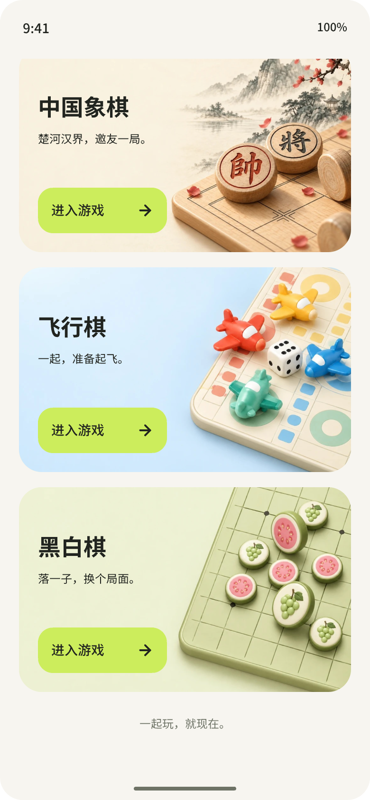
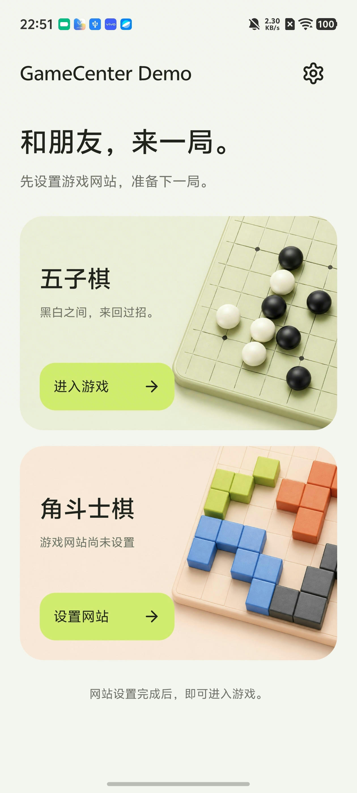

# GameCenter

一个可二次开发的 Android 小游戏容器 Demo。使用 Kotlin + XML + 系统 WebView，将自己部署的网页游戏放进 Android 应用。

项目起因：[gomoku #1 — 作者你能打包好么](https://github.com/iceGoX/gomoku/issues/1)。本项目提供 Android 容器，游戏源码与 Python 后端分别维护在：

- [iceGoX/gomoku](https://github.com/iceGoX/gomoku)：五子棋，在线房间与本地同屏双人。
- [iceGoX/blokus](https://github.com/iceGoX/blokus)：角斗士棋，在线房间与本地同屏多人。

**同一套代码提供 Demo 和商店两个版本。** Demo 不提供默认服务器；商店版由发布者在构建时注入默认游戏地址。两者都支持安装后修改网站，无需重新打包。

| 产品变体 | Demo | Store |
| --- | --- | --- |
| applicationId | `com.icego.gamecenter.demo` | `com.icego.gamecenter` |
| 名称 | GameCenter Demo | GameCenter |
| 默认网站 | 空 | 本地 `store.properties` 注入 |
| 配置入口 | 大厅设置图标或未配置卡片 | 大厅设置图标 → 选择游戏 |
| 清空自定义地址 | 未配置 | 恢复默认网站 |

包名不同，两版可以共存且配置相互独立。debug/release 是另一维度，分别控制调试和发布构建。

当前大厅收录五子棋、角斗士棋、中国象棋、飞行棋和黑白棋。每款游戏独立配置网站，继续复用同一 WebView 容器。

## 设计预览

新增中国象棋、飞行棋、黑白棋的 Pixso 设计（非设备截图），完整说明见 [五款游戏设计](docs/design/README.md)。



## 界面截图

原两款游戏版 Demo 大厅（历史设备截图；五款游戏设计见 [设计说明](docs/design/README.md)）：



## 快速开始

1. 按上游仓库说明部署游戏网站和在线房间服务，配置可信的 HTTPS 证书。
2. 用 Android Studio 打开本项目根目录，等待 Gradle 同步，在 Build Variants 选择 `demoDebug` 后运行 `app`。
3. 点击某个游戏的“配置网站”，输入完整网页目录地址，例如：
   - 五子棋：`https://games.example.com/wuziqi/`
   - Blokus：`https://games.example.com/blokus/`
   - 中国象棋：`https://games.example.com/xiangqi/`
   - 飞行棋：`https://games.example.com/feixingqi/`
   - 黑白棋：`https://games.example.com/heibaiqi/`
4. 保存后点击“开始游戏”。五款游戏可使用不同域名、端口；同一联机房间的玩家必须连接同一套游戏服务。

以上域名仅为占位示例。输入的是网页入口，不是 `/api/`。Demo 清空输入并保存可移除配置；未配置时不能进入该游戏。商店版清空自定义地址会恢复默认。

## 构建商店版

```sh
cp store.properties.example store.properties
# 将 store.properties 中的五个占位 URL 改为自己的 HTTPS 游戏目录地址
./gradlew :app:assembleStoreDebug
```

`store.properties` 已加入 `.gitignore`。五个地址均须为 HTTPS、以 `/` 结尾；缺失或非法时商店版构建失败，Demo 不受影响。更换配置文件可传 `-PstoreConfigFile=/path/to/config.properties`。

Store 调试 APK 在 `app/build/outputs/apk/store/debug/app-store-debug.apk`。正式 AAB 使用 `./gradlew :app:bundleStoreRelease`，输出在 `app/build/outputs/bundle/storeRelease/`；当前未配置正式签名，不可直接作为已签名成品提交商店。域名会进入商店安装包，不是秘密。

## 当前能力与 Issue 范围

| 能力 | 当前状态 |
| --- | --- |
| Android 游戏大厅、设置与网站编辑页、共用 WebView 容器 | 已实现 |
| 安装后修改网站地址并保存在设备上 | 已实现 |
| 复用上游网页玩法和在线房间 | 已接入，需配合自己的部署验收 |
| 页面加载进度、失败重试、退出确认 | 已实现 |
| 旋转屏幕保留当前 WebView | 已实现 |
| 首次启动即完全离线游玩 | 未实现：安装包没有内置游戏资源 |
| 本地前端直接连接自定义 API 服务 | 未实现：当前更换的是整站网页地址 |

当前网页的“本地模式”仍需先加载网页，不能依赖 WebView 缓存承诺断网可用。因此当前版本只覆盖 Issue #1 的部分需求，不能据此关闭该 Issue。

## 开发与架构

核心分为游戏目录（`Game`）、服务地址及存储（`GameServer` / `GameSettings`）、大厅（`MainActivity`）、设置与网站编辑（`SettingsActivity` / `ServerActivity`）及游戏容器（`GameActivity`）。没有额外网络库或 JS Bridge。

选择 WebView 是为了直接复用现有 HTML / CSS / JavaScript。Lynx 需要迁移 UI 与浏览器 API 后生成 Lynx Bundle；当前未接入 Lynx SDK。

- [开发指南](docs/DEVELOPMENT.md)：环境准备、部署、修改、新增游戏、测试与发布边界。
- [AGENTS.md](AGENTS.md)：项目摘要及 AI 编码约定。

## 构建与验证

Android 10（API 29）及以上。使用 Android Studio 自带 JDK；当前配置为 AGP 9.0.1、Gradle 9.2.1、compileSdk 36.1、targetSdk 36。

```sh
./gradlew :app:testDemoDebugUnitTest :app:assembleDemoDebug :app:lintDemoDebug
```

Debug APK：`app/build/outputs/apk/demo/debug/app-demo-debug.apk`。它是开发测试包，不是已经签名发布并通过商店审核的产品。

## 发布定位

开源 Demo 默认不连接任何线上服务；Store 默认连接发布者配置的服务。运营者承担相应部署和流量成本。

商店变体目前已提供默认在线入口，若要公开上架，建议继续补齐内置离线模式；服务器容量需要独立压测。Android 包中使用的域名可被提取，移出源码不等于隐藏服务器或限制访问。

复用和分发上游代码、图片与品牌前，请核对对应仓库及第三方资源的许可；本说明不替代授权，也不新增许可。
